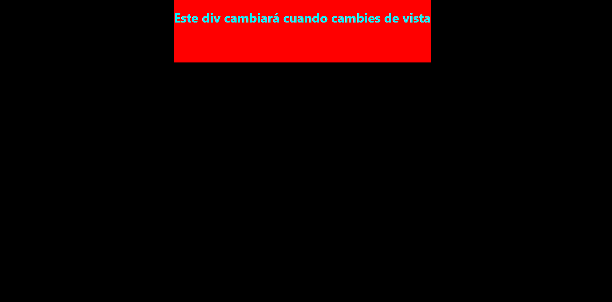
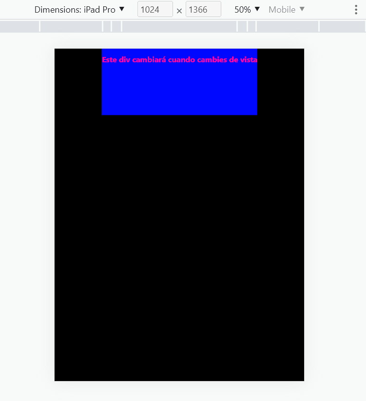
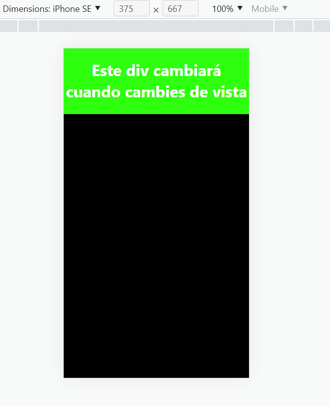

# [Bootcamp Web Developer Full Stack](https://www.thebridge.tech/bootcamps/bootcamp-fullstack-developer/)

### HTML, CSS,  JS, ES6, Node.js, Frontend, Backend, Express, React, MERN, testing, DevOps

 


# SASS

SASS es el mejor ayudante para el desarrollador web a la hora de trabajar en CSS gracias a sus múltiples funcionalidades: **mixins, variables, funciones, herencia, nesting**.

## ¿Qué hace potente a SASS?
La principal ventaja de SASS es la posibilidad de convertir los CSS en algo dinámico. Permite trabajar mucho más rápido en la creación de código con la posibilidad de crear funciones que realicen ciertas operaciones matemáticas y reutilizar código gracias a los mixins, variables que nos permiten guardar valores. SASS, en definitiva, se convierte en tu mejor ayudante.

## DIFERENCIA ENTRE USAR SASS Y USAR CSS


Como se puede comprobar en la siguiente imagen a la izquierda tenemos el mismo estilo **css** pero usando *variables* y a la derecha de la imagen sería el código *css estándar*.

Vamos a ver cada código separado para que sea más entendible:


1. **CSS ESTÁNDAR**
```css
body {
  font: 100% Helvetica, sans-serif;
  color: #333;
}

```
2. **CSS CON SASS**
```css
$font-stack: Helvetica, sans-serif;
$primary-color: #333;

body {
  font: 100% $font-stack;
  color: $primary-color;
}

```
La principal ventaja de **Sass** con respecto a **Css puro** es que podemos usar **mixins, variables, funciones, herencia, nesting** ([más info](https://www.ondho.com/que-es-sass-y-por-que-los-css-pueden-volver-a-divertirnos/)) para reutizar propiedades de estilos más adelante  , sin tener que copiar y pegar lineas interminables de código  


# INSTALACIÓN
Para instalar SASS bajo *NodeJS* tenemos que ejecutar el  siguiente comando

``` 
 npm install -g sass

``` 

### Para instalar SASS sin *NodeJS* 

 Si has llegado hasta aquí esperemos que te hayas animado a darle una oportunidad para volver a disfrutar con los CSS. Veamos ahora cómo instalarlo.

SASS está creado en Ruby, por lo que primero debemos tenerlo instalado en nuestro sistema operativo.

##- Mac OS X
Para Mac es muy sencillo pues ya viene con el intérprete de Ruby instalado.
Simplemente debemos abrir una ventana del terminal (terminal.app)

Instalar la gema de ruby estable:

```javascript
 sudo gem install compass`
```
O si eres de los valientes que no pueden esperar para probar las últimas novedades:
 
```javascript
 sudo gem install compass --pre`
```
 
##- Windows
Debemos primero instalar Ruby. Lo puedes encontrar aquí https://rubyinstaller.org/downloads/

Puedes comprobar tu versión de Ruby con:

```javascript
 ruby -v
```

Posteriormente, abres una ventana del modo comandos de Windows en modo administrador para instalar la gema.

```javascript
 gem install sass
```
 
Si quieres comprobar la versión:

```javascript
 sass -v
```
 
*Como hemos dicho, nuestro archivo .scss y .sass no lo puede interpretar directamente el navegador, por lo que se tiene que convertir a la extensión CSS. Podemos utilizar diferentes formas:
Disponemos de varios programas que se pueden instalar en nuestro SO:*

## Para windows y Mac
http://livereload.com/

## Sólo Mac
http://incident57.com/codekit/

Asimismo, podemos usar la línea de comandos con una sintaxis como esta:

```javascript
sass --watch filename.scss:filename.css
```


# EJERCICIO PRACTICO DE SASS EN REACT

1. Creamos un proyecto de React. En este caso le llamaremos **proyecto-sass**

```js
npx create-react-app proyecto-sass
```

2. Instalamos **sass** en **React**

```js
npm install sass
```
3. Creamos la carpeta **sass** dentro de **src**

```js
./src/sass

```
4. Dentro de ella creamos 2 archivos , el primero se llamará **colors.scss**

```sass
$color-primary : #ffffff;
$color-bg:   #000000;  
$color-bg-div-desktop:  red;
$color-bg-div-mobile:  rgb(46, 255, 14);
$color-bg-div-tablet:  rgb(0, 8, 255);

```

5. Creamos dentro de **sass** nuevamente otro archivo que se llamará **querys.scss**
```sass
 
@mixin tablet {
  @media only screen and (min-width:801px) {
    @content;
  }
}
 

@mixin desktop {
  @media only screen and (min-width:1281px) {
    @content;
  }
}
 
```

6. Creamos otra vez otro archivo **App.scss**

```sass
@import "./colors.scss";
@import "./querys.scss";

.container {
  display: flex;
  justify-content: center;
  text-align: center;
  background-color: $color-bg;
  color: $color-primary;
  height: 100vh;
  > div {
    height: 20vh;

    background-color: $color-bg-div-mobile;
    @include tablet {
      color: rgb(255, 0, 162);
      background-color: $color-bg-div-tablet;
    }
    @include desktop {
      color: rgb(0, 247, 255);
      background-color: $color-bg-div-desktop;
    }
  }
}

```

7. Fuera de la carpeta **./sass** eliminamos **App.css**

8. Editamos el archivo **App.js** 

```js
 
import './sass/App.scss';

function App() {
  return (
    <div className="container">
  
  <div >
  <h1>Este div cambiará cuando cambies de vista</h1>

  </div>
    </div>
  );
}

export default App;

```

8. Por último arrancamos la aplicación y nos aparecerán estas vistas: 

-  Vista escritorio

-  Vista tablet

-  Vista mobile



- [SASS-SABER MÁS](https://www.ondho.com/que-es-sass-y-por-que-los-css-pueden-volver-a-divertirnos/)

- [SASS-DOC-OFICIAL](https://sass-lang.com/documentation)


